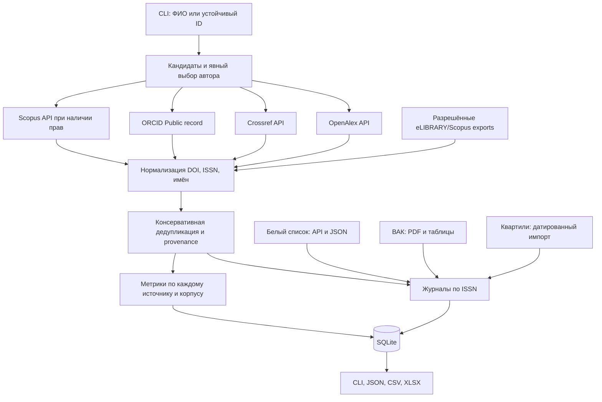

# SciAgg RU — агрегатор научной библиографии

Рабочий учебный прототип на Python 3.12 для магистерской работы по наукометрии. Он находит кандидатов в авторы, получает публикации по выбранному идентификатору, объединяет записи по DOI, сохраняет показатели каждого источника отдельно и обогащает журналы по ISSN. Дата исследовательского среза: **10 сентября 2026 года**.

Основной текст для сдачи — [REPORT_RU.md](REPORT_RU.md). Для подготовки к защите — [DEFENSE_CHEATSHEET_RU.md](DEFENSE_CHEATSHEET_RU.md). Библиография — [SOURCES.md](SOURCES.md); подробные ограничения — [RESEARCH_NOTES.md](RESEARCH_NOTES.md).

**Исправление ошибки задания:** для `[10, 8, 5, 4, 3, 1]` индекс Хирша равен **4**. У пятой статьи не пять, а три цитирования.

## Быстрый запуск в Windows PowerShell

В этой рабочей папке окружение уже установлено. Команды выполняются из корня проекта:

```powershell
cd C:\sarychev\Codex\rgau
.venv\Scripts\python.exe -m sciagg demo
.venv\Scripts\python.exe -m sciagg h-index 10 8 5 4 3 1
.venv\Scripts\python.exe -m pytest -q
```

`demo` читает сохранённый реальный профиль Хирша из `examples/demo_profile.json` и работает без Интернета. Вывод явно указывает, что это снимок, а не новый запрос. В профиле загружена небольшая часть публикаций; локальный h-index по этой части не подменяет полный показатель автора.

## Установка на другом компьютере

Нужен Python 3.12 или новее. В PowerShell:

```powershell
py -3.12 -m venv .venv
.venv\Scripts\python.exe -m pip install -e ".[dev]"
.venv\Scripts\python.exe -m sciagg sources
```

Linux/macOS: `python3.12 -m venv .venv`, затем `.venv/bin/python -m pip install -e '.[dev]'`. Используйте `.venv/bin/python` вместо Windows-пути в примерах. Активация окружения не обязательна. Установленный console script `sciagg` эквивалентен `python -m sciagg`.

Зависимости: `httpx` для HTTP, `openpyxl` для импорта/экспорта XLSX, `pypdf` для официального PDF ВАК. Dataclasses, SQLite, CLI, JSON/CSV и алгоритмы сопоставления используют стандартную библиотеку. `pytest` и `ruff` входят в группу `dev`. Проверенные точные версии записаны в `requirements-validated.txt`; файл отражает окружение проверки, а не обещание бессрочной совместимости.

## Конфигурация

Без ключей работают проверенные запросы Crossref, ограниченные OpenAlex, публичное чтение ORCID и API «Белого списка». Возможны сетевые и квотные ограничения. Переменные перечислены в [.env.example](.env.example). Файл `.env` **не загружается автоматически**: задайте только нужные переменные в терминале:

```powershell
$env:CROSSREF_MAILTO = 'your-real-email@example.org'
$env:OPENALEX_API_KEY = 'your-key'
$env:ORCID_ACCESS_TOKEN = 'your-read-public-token'
$env:SCOPUS_API_KEY = 'your-elsevier-key'
$env:SCOPUS_INST_TOKEN = 'your-institution-token'
```

Это альтернативные необязательные настройки, не инструкция получить все ключи. Не используйте вымышленный email для Crossref polite pool.

- OpenAlex: бесплатный ключ в [настройках API](https://openalex.org/settings/api); на дату исследования ограниченное анонимное использование также поддерживается.
- ORCID: `/read-public` token выдаётся по [официальному OAuth-процессу](https://info.orcid.org/documentation/integration-and-api-faq/). В программе принимается готовый bearer token. Пароль пользователя не нужен.
- Elsevier: ключ в [Developer Portal](https://dev.elsevier.com/). Доступ к подписным данным определяется правами организации, IP/Insttoken и конкретным API; ключ не гарантирует полный Scopus. Получение или обход чужих прав программа не реализует.

## Поиск и профиль

```powershell
.venv\Scripts\python.exe -m sciagg search-author "Jorge Hirsch"
.venv\Scripts\python.exe -m sciagg search-author "Иванов Иван Иванович" --limit 5 --json
.venv\Scripts\python.exe -m sciagg author-profile A5036688434 --limit 3 --export examples/hirsch.json
.venv\Scripts\python.exe -m sciagg author-profile A5072248970 --limit 3 --export examples/novoselov.csv
.venv\Scripts\python.exe -m sciagg author-profile A5058357018 --limit 3 --export examples/geim.xlsx
```

IDs в примерах получены реальным поиском; это профили OpenAlex J. E. Hirsch, Kostya S. Novoselov и A. K. Geǐm. Их правильность оценивается по имени, публикациям и аффилиациям, а не лишь по первому месту в выдаче. Названия и агрегаты принадлежат OpenAlex.

Передача имени в `author-profile` возвращает кандидатов и код 2 (`requires_selection`). Команда намеренно не выбирает первого однофамильца. Повторите её с проверенным `A...` ID. `--source orcid` принимает ORCID iD: профиль берётся из ORCID, корпус работ — по точному ORCID-фильтру Crossref. `--source scopus` принимает числовой Scopus Author ID при настроенном ключе. Crossref не имеет собственного реестра полных авторских профилей; его результаты поиска — кандидаты из авторских полей публикаций.

Параметр `--limit` ограничен 1–100. Каждый DOI в выбранном корпусе может потребовать дополнительный запрос к другим источникам. Сеть последовательная, с интервалом, кэшем, тайм-аутом и ограниченными повторами. Не считайте небольшой sample полным списком работ автора.

## Публикация и журнал

```powershell
.venv\Scripts\python.exe -m sciagg publication 10.1073/pnas.0507655102 --export examples/hirsch_article.json
.venv\Scripts\python.exe -m sciagg journal --issn 2079-3537 --json
.venv\Scripts\python.exe -m sciagg --offline journal --issn 2079-3537 --json
```

`publication` пытается получить запись Crossref/OpenAlex/Scopus, объединяет DOI-дубликаты и сохраняет все наблюдения цитирований. Отсутствующий Scopus не прерывает успешные источники. `journal` объединяет локальные классификации со свежим или кэшированным ответом «Белого списка». Уровень за конкретный год, дата включения/исключения и статус снимка сохраняются; `null` не превращается в ноль или Q4.

Глобальные параметры `--offline`, `--db`, `--cache` ставятся **перед** подкомандой. Offline читает только точные сохранённые запросы и сохраняет дату первоначального получения. Если кэша нет, возвращается понятная недоступность источника.

## Российские перечни и разрешённые импорты

Исходные реальные выгрузки, контрольные суммы и описание — [data/README.md](data/README.md). PDF ВАК датирован 14.08.2026; выгрузка «Белого списка» получена 10.09.2026. Последующая актуализация требует новых снимков.

```powershell
.venv\Scripts\python.exe -m sciagg import-whitelist data/raw/whitelist_2026-09-10.json --source-url "https://journalrank.rcsi.science/ru/record-sources/download/?dataType=Json" --snapshot-date 2026-09-10 --export examples/whitelist_import_audit.json
.venv\Scripts\python.exe -m sciagg import-vak data/raw/vak_2026-08-14.pdf --source-url "https://vak.gisnauka.ru/documents/editions" --snapshot-date 2026-08-14 --export examples/vak_import_audit.json
```

Разбор PDF на 1 277 страниц занимает несколько минут. Для повторяемого восстановления можно использовать [scripts/rebuild_database.py](scripts/rebuild_database.py), включая проверенную промежуточную выгрузку ВАК; точные команды — в `data/README.md`. Импорт не удаляет существующую базу. Для отдельного эксперимента задайте `--db data/experiment.sqlite` перед подкомандой.

Ошибочные строки помещаются в аудит с исходными полями, а не исправляются догадкой. Наличие отклонённых строк даёт код завершения 2 после сохранения корректной части. ВАК: 3 202 строки приняты, 27 отправлены в карантин из 3 229. Данные о специальностях и датах сохраняются вместе; категория К1/К2/К3 не извлекается из PDF, где её нет. Для категорий предусмотрен нормализованный импорт из отдельного датированного источника.

Нормализованные CSV/XLSX/JSON поддерживают колонки `title`, `issn` или `issns`, `eissn`, `status`, `value`, `year`, `specialties`, `subject_category`, `system`, `effective_from`, `effective_to`. Список ISSN в таблице разделяется `;`. Для ВАК обязателен явный `status`; для квартиля — `value=Q1..Q4`, `year`, `subject_category`, `system`. Названия колонок произвольной внешней таблицы сначала приводятся к этому контракту: приложение не угадывает их смысл.

```powershell
.venv\Scripts\python.exe -m sciagg import-ranking examples/templates/rankings.csv --source-url "synthetic:teaching-fixture" --snapshot-date 2026-09-10
.venv\Scripts\python.exe -m sciagg import-publications examples/templates/elibrary.json --source elibrary --source-url "synthetic:teaching-fixture"
```

Шаблоны **синтетические**, не рейтинги реальных журналов. Для eLIBRARY/Scopus импортируются законно полученные данные в нейтральной схеме. Автоматического конвертера всех собственных форматов этих систем нет. Поля `authors` и `issns` в CSV/XLSX такого импорта содержат JSON-массивы; пример структуры — `elibrary.json`.

## Экспорт и хранение

```powershell
.venv\Scripts\python.exe -m sciagg demo --export examples/demo.csv
.venv\Scripts\python.exe -m sciagg demo --export examples/demo.xlsx
.venv\Scripts\python.exe -m sciagg demo --export examples/demo.json
```

JSON содержит весь профиль, происхождение полей, статусы источников, классификации и покрытие. CSV/XLSX дают удобную таблицу публикаций; рядом сохраняется `.profile.json` с полными данными. Длинные raw-поля могут превысить ограничения ячейки Excel, поэтому исходным полным экспортом считается JSON. Текст, похожий на формулу Excel, экспортируется как текст.

SQLite содержит авторов, публикации, авторство, журналы и ISSN, наблюдения метрик, происхождение и классификации. Повторное получение сохраняет историю наблюдений. Поиск библиографии между разными запусками не означает автоматического слияния всех похожих строк базы: дедупликация выполняется для текущей полученной партии; идентификаторы источников и исходные записи остаются доступны для проверки.

## Архитектура



Реальные контракты и алгоритмы описаны в [REPORT_RU.md](REPORT_RU.md). Отдельные возможности провайдеров не обязаны быть одинаковыми: у ORCID нет цитирований, у Crossref нет полноценного авторского профиля, eLIBRARY работает через импорт.

## Проверка и устранение проблем

```powershell
.venv\Scripts\python.exe -m pytest -q
.venv\Scripts\python.exe -m ruff check src tests scripts
.venv\Scripts\python.exe -m ruff format --check src tests scripts
.venv\Scripts\python.exe examples/live/validate_international.py
```

Последняя команда — отдельная живая проверка; обычные тесты сети не требуют. Точный итог финального прогона и выполненные команды находятся в [VALIDATION.md](VALIDATION.md). Каталог `data/pytest-local` используется **только** для временных файлов тестов и может очищаться pytest; не кладите туда свои данные.

- `ModuleNotFoundError`: используйте Python из `.venv` и выполните установку `-e ".[dev]"`.
- 401/403: проверьте свои права; ключ не создаёт подписку. Остальные источники продолжают работу.
- 429: квота/скорость исчерпана; дождитесь сброса. Программа не обходит лимиты и не повторяет запрос раньше длинного `Retry-After`.
- `offline: отсутствует сохранённый ответ`: ранее не выполнялся идентичный запрос. Для полностью автономной демонстрации используйте `demo`.
- Не найден ISSN или строка отклонена: проверьте контрольную цифру и аудит импорта. Это не доказательство отсутствия журнала в перечне.
- Выдача по ФИО неоднозначна: уточните профиль по DOI, аффилиации, тематике и устойчивым ID.
- PDF изменил макет: парсер проверенной версии может отказать или потребовать проверки аудита; используйте нормализованный экспорт, не меняйте координаты без сверки результата.
- TLS/сеть: программа сохраняет проверку сертификатов. Нет гарантии доступности источника из любой сети.

Прототип не принимает решения о выполнении диссертационных требований и не создаёт универсальный рейтинг исследователя. Классификации имеют разные назначения, даты и основания; применимость конкретной публикации проверяется по актуальному нормативному документу и специальности.

Полная проверенная база обоих перечней находится отдельно: `data/rebuilt.sqlite` (32 195 журналов). Для запросов к ней добавьте `--db data/rebuilt.sqlite` перед подкомандой. В объединённом импорте 4 строки ВАК дополнительно отправлены на проверку из-за конфликтующих связей ISSN; подробности в `examples/rebuild_audit.json`.

