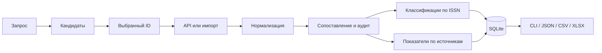

# Агрегация научной библиографии и показателей исследователя: российский контекст 2026 года

Учебный проект магистратуры по наукометрии. Исследовательский срез — **10 сентября 2026 года**. Практический результат — локальное приложение **SciAgg RU**, исходный код, проверяемые исходные данные, автоматические тесты и демонстрационные экспорты. Учебное заведение, дисциплина, ФИО обучающегося и руководителя добавляются в соответствии с требованиями кафедры.

## 1. Введение

Научные публикации описываются одновременно в нескольких информационных системах. Одни системы преимущественно регистрируют библиографические метаданные, другие строят граф цитирования, третьи поддерживают идентификаторы исследователей, четвёртые классифицируют журналы для определённых задач оценки. Поэтому сведения о публикационной деятельности нельзя корректно представить одной таблицей «автор — число статей — индекс Хирша — квартиль» без указания источников и дат.

В российской практике необходимо различать РИНЦ и платформу eLIBRARY, перечень ВАК, Единый государственный перечень научных изданий («Белый список») и международные базы. Их назначения частично пересекаются, но записи и классификации не эквивалентны. Изменение нормативных перечней и условий API делает проверку первоисточников обязательной. В этой работе использованы официальные документы и реальные ответы систем; библиографический список и даты доступа приведены в [SOURCES.md](SOURCES.md).

## 2. Цель, задачи и метод

Цель — исследовать доступные источники научной библиографии и разработать воспроизводимый прототип, который объединяет записи об авторах, публикациях и журналах, сохраняя происхождение информации и границы применимости показателей.

Задачи: уточнить терминологию; проверить доступность API и выгрузок на дату исследования; построить нормализованную модель; реализовать идентификацию автора и дедупликацию публикаций; присоединить российские классификации по ISSN; рассчитать h-index по явно заданному корпусу; сохранить данные в SQLite; проверить программу на синтетических граничных случаях и открытых реальных примерах.

Метод включает документальный анализ первичных источников, небольшие сетевые эксперименты, сохранение исходных ответов с датами, проектирование правил сопоставления и автоматическое тестирование. Свежесть утверждения оценивается по содержанию документа и фактическому ответу сервера: дата обращения сама по себе не делает старую классификацию новой.

## 3. Сопоставление систем

| Система | Основная роль в работе | Что нельзя из неё автоматически заключать |
|---|---|---|
| eLIBRARY / РИНЦ | Российская библиография, профили и показатели в собственной базе | Любая запись eLIBRARY входит в РИНЦ; любой показатель относится к ядру |
| ВАК | Датированный перечень рецензируемых научных изданий и сопутствующие документы | Наличие названия достаточно для любой специальности и даты |
| Белый список / ЕГПНИ | Уровни и статус издания, собственная методика оценки | Уровень 1 равен Q1 Scopus; поле 2025 является уровнем за 2026 |
| Scopus | Библиографическая и цитатная база Elsevier | Ключ API обеспечивает всю подписную функциональность |
| Crossref | DOI-метаданные, авторские поля и связи цитирования в Crossref | Результаты поиска по имени составляют полный профиль человека |
| ORCID | Устойчивый iD и публичные утверждения в записи исследователя | Все работы заполнены; ORCID рассчитывает citation count или h-index |
| OpenAlex | Открытый граф работ, авторов, организаций и источников | Его авторские кластеры безошибочны; его метрики являются Scopus-метриками |

Подробная техническая матрица с доступом, стоимостью, лимитами и реализованными возможностями — [SOURCE_CAPABILITIES.md](docs/SOURCE_CAPABILITIES.md).

## 4. РИНЦ, eLIBRARY и неоднозначность RSCI

eLIBRARY.RU — платформа электронной библиотеки и аналитических сервисов. РИНЦ — Российский индекс научного цитирования, размещённый на этой платформе. Объём платформы, состав РИНЦ и состав Ядра РИНЦ следует различать. Аналитические страницы могут показывать публикации, цитирования, связи с организациями, профили авторов и показатели журналов. AuthorID, SPIN-код, идентификатор публикации/EDN и DOI относятся к разным пространствам идентификаторов и не заменяют друг друга.[^1]

В англоязычных текстах похожие сокращения используются неоднозначно. В данной работе **РИНЦ** обозначает национальную базу, **RSCI** — отдельно отобранный Russian Science Citation Index, **Ядро РИНЦ / RISC CORE** — собственный экспертно формируемый массив. Нельзя механически приравнивать эти названия. Регламент от 18.02.2026 включает основания отбора, выходящие за простое объединение журналов WoS CC, Scopus и RSCI: предусмотрены другие экспертно отобранные журналы, книги и труды конференций.[^2]

API eLIBRARY существует. Однако из этого не следует свободный анонимный доступ к любому авторскому профилю. В этой среде официальная страница API встретила блокировку IP; действующие договорные условия, квоты, стоимость и полный набор методов не удалось подтвердить. Автоматизация через обход защиты не выполнялась. Реализован нейтральный импорт разрешённых пользователю метаданных; он не выдаётся за прямую интеграцию РИНЦ. Старые сведения об условиях API не перенесены в проект без проверки.[^3]

## 5. ВАК и перечень рецензируемых изданий

ВАК — Высшая аттестационная комиссия при Минобрнауки России. Её перечень связан с опубликованием основных результатов диссертаций. Для практической проверки значимы дата версии перечня, журнал, научная специальность/отрасль науки и периоды применимости. На официальном сайте отдельно размещаются перечни, материалы категорирования К1–К3 и документы о приравнивании изданий. К1–К3 не являются квартилями.[^4]

Скачанный в ходе работы официальный PDF содержит перечень **по состоянию на 14.08.2026**. Страница сайта опубликована позднее; поисковый индекс ещё показывал июньскую версию. Проверен заголовок самого документа. Файл имеет 1 277 страниц, нумерация заканчивается на 3 229. Колонки содержат номер, название, ISSN, специальности/отрасли и даты; отдельной колонки eISSN в проверенной версии нет.[^5]

Сайт представляет собой JavaScript-приложение. Его публичный JSON-ресурс использован при исследовании для обнаружения актуального официального вложения. Этот ресурс не объявлен стабильным API реестра; эксплуатационный прототип опирается на скачанный PDF и импорт таблиц. Массив вложений включает исторические версии, поэтому первый файл массива не обязательно актуален.

Парсер выделяет колонки по координатам и хранит специальности вместе с датами. Прежние ISSN в истории названия не считаются текущими идентификаторами. Типографская кириллическая «Х» в позиции контрольного символа заменяется на латинскую X с сохранением оригинала. Несходящаяся контрольная цифра не «исправляется» подбором. Результат: **3 202 принятые строки, 27 строк карантина**, полный набор 3 229 учтён. Статус `listed_in_snapshot` означает присутствие в данном снимке, а не автоматическое заключение о пригодности статьи для защиты по конкретной специальности.

## 6. Белый список / ЕГПНИ

Официальный ресурс поддерживает Российский центр научной информации; решения об изменениях относятся к межведомственной рабочей группе. В актуальном описании ЕГПНИ используется при оценке научной деятельности, включая публикации результатов диссертаций. Поэтому противопоставление «ВАК только для диссертаций, Белый список только для организаций» недостаточно точно. В приложении эти основания сохраняются раздельно, без автоматического правового приравнивания.[^6]

Уровни 1–4 относятся к собственной методике. Российская часть обновлялась по методике 2025 года; сведения об иностранных журналах могут иметь классификационный год 2023. В мае 2026 года РЦНИ сообщил о новых включениях, изменениях уровней и исключении по решению марта 2026 года. Год поля — часть смысла значения, а не технический суффикс.[^7]

У «Белого списка» есть **документированный открытый API**: `GET /api/record-sources/{issn}/level`. Он возвращает названия, ISSN, годовые уровни, отметки и даты включения/исключения. HTTP 400 в этом endpoint означает, что журнал по ISSN не найден. В примере документации уже присутствует `level_2026`, хотя описание схемы отстаёт. Поэтому парсер обрабатывает `level_YYYY`, сохраняя и непустые значения, и null.[^8]

Также доступна полная JSON/CSV-выгрузка. Полученный JSON включает **31 576 объектов**, из них 515 имеют дату исключения. В JSON полного экспорта поле называется `issns`, а в API одного журнала — `issn`; даты также имеют разные стили именования. Метки других баз содержат собственные даты обновления: они не заменяют свежую прямую проверку Scopus. Проект реализует обе формы доступа; подробный аудит импорта отделяет строки исходного массива от уникальных журналов SQLite.

## 7. Scopus и Elsevier API

Scopus — библиографическая и цитатная база Elsevier. Scopus Author ID идентифицирует авторский профиль внутри этой системы; записи документов имеют собственные IDs/EID и могут включать DOI, библиографию, авторов и число цитирований. Профили, количество документов и h-index зависят от состава базы и работы алгоритмов разрешения авторства.

Официальные интерфейсы охватывают Author Search, Author Retrieval, Scopus Search, Abstract Retrieval, Citation Overview и Serial Title. В прототипе реализованы запрос профиля по Author ID, поиск документа по DOI, ограниченная выборка по AU-ID и получение исходного ответа Serial Title по ISSN. Авторский поиск Scopus, полный Abstract Retrieval и Citation Overview в CLI не реализованы. Таблица проверенных адресов и источников документации приведена в [исследовании международных API](docs/INTERNATIONAL_SOURCES_RESEARCH.md).

Каждый запрос Elsevier требует API key. Дополнительные права зависят от подписки, IP или предоставленного оператором Insttoken. Доступ к Citation Overview контролируется отдельно. Отсутствие ключа отображается как недоступность провайдера; не возвращаются ни вымышленные нулевые цитирования, ни искусственные h-index. Авторизованный живой Scopus в данной работе не проверен, поскольку ключ и права не предоставлялись.[^9]

## 8. Число цитирований как измерение

Для публикации p корректнее рассматривать `c(p, D, t, F)`, где D — база, t — момент снимка, F — правила отбора и учёта. Различия возникают из-за охвата журналов и типов документов, языкового состава, задержек индексации, доступности списков литературы, связывания ссылок, дубликатов и правил самоцитирования. Число входящих цитирований нельзя путать с длиной списка литературы публикации.

Crossref передаёт `is-referenced-by-count`; OpenAlex — `cited_by_count`. Это разные наблюдения. Для DOI **10.1073/pnas.0507655102** реальные запросы 10.09.2026 дали **8 736 Crossref** и **11 697 OpenAlex**. Наблюдения сохранены в `examples/live/international_validation.json`, включая сырой ответ, источник и время. Их различие само по себе не устанавливает ошибку одного из поставщиков. Суммирование даёт двойной учёт неизвестной величины пересечения и в проекте запрещено по методологии.

Прототип не исключает самоцитирования: необходимые полные списки цитирующих работ и достоверная идентификация всех авторов не собирались. Отсутствие такой коррекции указано как ограничение, а не скрыто за словом «очищенный».

## 9. Индекс Хирша

Пусть числа цитирований отсортированы по убыванию: c₁ ≥ c₂ ≥ … ≥ cₙ. Тогда

**h = max({0} ∪ {i: cᵢ ≥ i})**.

Это наибольшее количество работ h, каждая из которых имеет не менее h цитирований. В исходном задании приведён ошибочный ожидаемый ответ. Для `[10, 8, 5, 4, 3, 1]`:

| Номер работы i | cᵢ | Проверка cᵢ ≥ i |
|---:|---:|---|
| 1 | 10 | Да |
| 2 | 8 | Да |
| 3 | 5 | Да |
| 4 | 4 | Да |
| 5 | 3 | Нет |
| 6 | 1 | Нет |

Следовательно, **h=4**. Для h=5 пятая работа должна иметь хотя бы пять цитирований. Функция `h_index` независимо реализована в `normalization.py`, отклоняет отрицательные/нецелочисленные значения, сортирует вход и проходит по рангам. Сложность O(n log n), дополнительная память O(n). Проверены пустой набор, нули, одна работа, повторения, несортированные данные и обычный пример.

h-index различается между системами из-за различного корпуса и цитатного графа, а также ошибочной атрибуции. Он зависит от длительности карьеры и дисциплины и не измеряет индивидуальный вклад соавтора. Значения из авторского профиля сохраняются как source metrics. Локальный расчёт по загруженным статьям называется **h по полученной выборке**; даже при завершённой пагинации источника программа не объявляет его универсальным h-index человека.

## 10. Квартили журналов

Квартиль характеризует положение журнала в распределении внутри определённой системы, предметной категории и года. Условно Q1 соответствует верхней четверти, Q4 — нижней. Из-за одинаковых рангов, числа журналов и правил конкретной системы размеры групп не обязаны быть ровно 25%. Один журнал может относиться к нескольким категориям и иметь разные позиции в каждой.[^10]

Различаются CiteScore/percentile Scopus, SCImago SJR quartile и JCR JIF quartile. У них разные показатели, правила, категории и массивы сравнения. SJR — не само число цитирований, а показатель с весами; SNIP — ещё один самостоятельный показатель и не обозначение квартиля. Значение SJR из Serial Title нельзя автоматически преобразовать в Q1–Q4 без соответствующего ранжирования. Год выпуска отчёта также не обязательно совпадает с годом метрики.

Поэтому импорт квартиля требует `value`, `system`, `year`, `subject_category`, `source_url` и времени получения. Если категория или год неизвестны, строка отклоняется. В приложении нет автоматического получения подписных квартилей JCR; синтетические шаблоны проверяют схему, а не изображают реальные рейтинги. Уровни «Белого списка» и категории ВАК не переводятся в квартили.

## 11. Поля автора и происхождение информации

| Группа | Примеры | Правило хранения |
|---|---|---|
| Идентификаторы | ORCID, OpenAlex ID, Scopus Author ID, eLIBRARY AuthorID, SPIN | Отдельный namespace; валидировать формат, не считать разные ID одной строкой |
| Библиография | Название, DOI, год, журнал, ISSN, том/номер/страницы | Нормализованные ключи плюс исходная запись |
| Авторские сведения | Полное имя, варианты, организация, тематика, соавторы | Источник и дата; исторические аффилиации не выдаются за текущие |
| Наблюдаемые метрики | Citation count, source h-index, works count | Значение, база, время снимка, область расчёта |
| Производные сведения | Уверенность совпадения, h по выборке | Алгоритм, входной корпус, ограничения |

Dataclass `Author` содержит имя, варианты, идентификаторы, аффилиации, темы, DOI-связи, соавторов и метрики. Отчество или транслитерация не угадываются автоматически; исходные формы остаются в provenance. ORCID-профиль может содержать подразделения, страны и employment assertions, но не каждое поле разворачивается в отдельный столбец: полный публичный JSON сохраняется. Публикационные аннотации не используются для идентификации; исходный API payload может содержать их, а автоматическое скачивание полных текстов не реализовано.

## 12. Разрешение неоднозначности автора

Алгоритм намеренно консервативен. Конфликт валидных ID в одном пространстве запрещает автоматическое слияние. Совпавший устойчивый ID при отсутствии конфликта даёт оценку 1.0. Без общего ID формируется объяснимый балл: совпадение нормализованного имени 0.2, общие DOI 0.3, аффилиация 0.2, соавторы 0.2. Максимум 0.9 требует проверки и не запускает автоматическое слияние. Это эвристический балл, **не откалиброванная вероятность**.

Пример A: одинаковый валидный ORCID и аффилиация — 1.0, точное совпадение в рамках доверия метаданным. Пример B: «Иванов И. И.» в ядерной физике Дубны и лингвистике Москвы без ID — одно имя не доказывает личность; профили сохраняются отдельно. Пример C: Ivan Ivanov, одна организация, пять общих DOI и несколько соавторов — сильные признаки для ручной проверки; автоматического объединения нет. Количество пересечений можно учитывать в будущей калибровке, текущая эвристика учитывает сам факт пересечения.

Поиск кандидатов в CLI сохраняет все профили. Пользователь выбирает устойчивый ID один раз; дальнейший корпус формируется по ID, а не повторным свободным поиском имени. Это снижает ложноположительные объединения ценой возможных пропусков и дополнительной проверки.

## 13. Дедупликация публикаций

Нормализация DOI устраняет различие регистра и формы `https://doi.org/...`/сырой DOI, обрабатывает Unicode и URL-кодирование, проверяет допустимый синтаксис. Значащая пунктуация суффикса не удаляется произвольно. ISSN приводится к форме XXXX-XXXX и проверяется по контрольной цифре; значение не удостоверяет качество журнала.[^11]

При конфликтующих DOI или общих ID одного источника записи остаются раздельными. Точный DOI либо одинаковый устойчивый ID источника являются сильным основанием. Когда ID нет, автоматическое объединение требует совпадения нормализованного названия, года и достаточно полных упорядоченных авторских данных. Fuzzy similarity используется для списка на проверку, а не для незаметного схлопывания записей.

Русское и английское параллельные названия, перестановка авторов, online-first/final год без DOI не разрешаются догадкой. При общем DOI разные годы/названия сохраняются как альтернативы и конфликтующие наблюдения. Кластер строится с проверкой совместимости каждого участника с остальными: промежуточная запись без DOI не соединяет два разных DOI. Вместе с основной записью сохраняются исходные члены кластера, альтернативные заголовки, IDs и все source metrics.

Для небольших демонстрационных наборов попарное сравнение имеет приемлемую O(n²) сложность. Для национального массива нужны блокирование по ключам, индексирование кандидатов и оценка precision/recall на размеченном корпусе; такой масштаб не заявляется.

## 14. Исследование API и решения о доступе

Выбор способа интеграции: официальный API → официальная выгрузка → разрешённый экспорт → стабильный машиночитаемый ресурс → допустимый HTTP-парсинг. Браузер не является зависимостью приложения. Защита, аутентификация и подписные ограничения не обходятся.

Crossref допускает публичные запросы и рекомендует реальный контакт для polite pool. В июле 2026 уточнены различающиеся лимиты одиночных и списочных запросов. OpenAlex в документации августа 2026 допускает небольшой анонимный бюджет; бесплатный ключ повышает лимит, `per_page` ограничен 100. Это важное отличие от устаревших примеров. ORCID предоставляет публичное чтение; видимость и полнота отдельных assertions определяются записью. Эти условия и точные endpoints проверены по официальной документации.[^12]

Код использует последовательные запросы, тайм-аут 30 секунд, до трёх попыток, ограниченный exponential backoff, `Retry-After` и доступные quota headers. Длинное ожидание квоты приводит к объяснимому отказу провайдера, а не раннему повтору. Кэш сохраняет исходную дату получения; offline не обновляет её. Ключи передаются через окружение и headers; не выводятся в диагностике или имени кэша. Полные публичные ответы хранятся локально как доказательства, а не публикуются внешним получателям.

## 15. Архитектура реализации

Приложение состоит из независимых адаптеров, доменной модели, сервисов сопоставления, HTTP-клиента, SQLite-хранилища и CLI. Общий протокол провайдера описывает возможности поиска/получения; адаптер может иметь только применимые операции. ORCID не обязан выдавать цитирования, а ВАК — искать исследователей.

`attempt` отделяет сетевой отказ и неожиданный формат одного поставщика от остальных. `Batch` сообщает общее число результатов, фактически полученную часть и признак завершённости. Сервис не добавляет в авторский корпус случайные результаты поиска однофамильцев. Дополнительный источник обогащает уже выбранные DOI.

## 16. Модель данных и SQLite

`Publication` хранит DOI, название/альтернативы, год, авторство, журнал, ISSN, source IDs, список цитатных наблюдений и исходные данные. Том, выпуск, страницы и даты присутствуют в `extra`/raw при наличии в ответе; они не обязательны для всех типов документов. `Journal` объединяет печатный и электронный ISSN при подтверждённой связи и хранит набор классификаций. Исторические названия/идентификаторы не сливаются по похожему тексту автоматически.

В SQLite используются таблицы `authors`, `publications`, `authorships`, `journals`, `journal_issns`, `metrics`, `provenance`, `journal_classifications`. Реляционные ключи обеспечивают связи, а JSON payload позволяет восстановить исходные утверждения и поля, не вынесенные в колонки. Классификации имеют источник, год, категорию и дополнительные даты. Обновление одной записи сохраняет наблюдения прошлых снимков; конфликт DOI при том же внутреннем ID отклоняется.

Объект `Provenance` содержит источник, внешний ID, URL, UTC-время и raw. В нормализованном поле обычно нет отдельного указателя на точный JSON-path: происхождение доступно на уровне записи и исходного поля. Это практический компромисс, явно ограничивающий удобство полевого аудита. Полные исходные записи при объединении не теряются.

## 17. Работа с метриками и неопределённостью

Отсутствие измерения хранится отдельно от наблюдаемого нуля. Недоступность API, отсутствие ключа, ненайденная запись, неполная пагинация и невалидный формат — разные состояния. При расчёте h по выборке для каждого источника выбираются последние наблюдения цитирований; противоречивые значения на одном последнем времени исключаются с указанием причины. Даты всех использованных наблюдений остаются в результате: кэш может содержать несколько времён снимка.

Покрытие содержит источник основного корпуса, total поставщика, число полученных работ, limit и completeness. Полный результат по одному API всё равно не доказывает полноты библиографии физического лица: ошибки идентификации и отсутствие документов в базе остаются возможными.

## 18. Реальные демонстрации

Проверены открытые профили OpenAlex: **J. E. Hirsch — A5036688434**, **Kostya S. Novoselov — A5072248970**, **A. K. Geǐm — A5058357018**. Живой эксперимент получил по три работы; на момент проверки API сообщил 384, 842 и 496 результатов соответственно. Для каждой выборки сохранено `complete=false`. Эти числа описывают ответ выбранного кластера, а не независимо установленное число работ человека.

Профиль Хирша дополнительно обогащён Crossref и классификациями журналов. Реальный ORCID `0000-0001-7175-3497` успешно прочитан без токена; получены публичное имя и 45 DOI-связей. По тому же ORCID выполнен фильтр работ Crossref. Пример не означает, что все записи ORCID так же заполнены или что чтение из любой сети будет доступно.

В автономной демонстрации `python -m sciagg demo` читается сохранённый JSON. Для свежего эксперимента используется `author-profile A5036688434 --limit 3`. Пример публикации Хирша по DOI показывает два разных числа цитирований без суммирования. Пример журнала 2079-3537 показывает реальный ответ открытого API «Белого списка».

## 19. Тестирование и верификация

Тесты проверяют математические и идентификационные свойства, конфликтующие DOI, слияние по source IDs, запрет объединения однофамильцев, границы fuzzy-сопоставления, сохранность provenance, SQLite refresh, тайм-ауты, 403/429, кэш с разными credentials, отсутствие ключей, карантин таблиц, JSON-массивы в CSV, XLSX, год/категорию квартиля и ошибки исходного задания. Отдельные тесты проверяют известный макет PDF ВАК, исторические ISSN и контрольную цифру.

Кроме тестов, реально выполнены установка пакета, CLI, открытые сетевые запросы, импорт полной российской выгрузки и PDF, JSON/CSV/XLSX-экспорт. Точный окончательный результат тестов, проверки стиля, количество записей импорта и команды приведены в [VALIDATION.md](VALIDATION.md). Это машинно подтверждённые результаты выполнения, а не оценка полноты всех внешних баз.

## 20. Ограничения и дальнейшая работа

Прототип не является заменой Scopus/РИНЦ и не принимает аттестационные решения. Не проверены авторизованные ответы Elsevier и договорный API eLIBRARY. Нет автоматического JCR/SJR category quartile enrichment без разрешённых исходных данных. Категории К1–К3 требуют отдельного датированного импорта. PDF-парсер привязан к проверенному макету; карантин обязателен для контроля качества.

Идентификация авторов основана на эвристиках без обучения и оценки на размеченном наборе. Не выполняются автоматическое установление связей переводных версий, нормализация всех ROR-организаций, подсчёт самоцитирований и реконструкция полного графа соавторов. Часть полей доступна только в исходном JSON. Поиск по имени и выборка по source ID могут воспроизводить ошибку поставщика.

Для развития целесообразны размеченный набор однофамильцев, precision/recall для сопоставления, раздельные таблицы версий/выражений работы, история аффилиаций, временные правила перечней и поддержка конкретных лицензированных экспортных форматов. Эти функции требуют отдельной проверки, а не расширения заявления о готовности текущей версии.

## 21. Заключение

Создан выполняемый прототип, демонстрирующий исследование реальных условий доступа, нормализацию, объяснимое сопоставление, source-specific metrics и воспроизводимые импорты российских перечней. Существенными результатами являются исправление математической ошибки h-index в задании, проверка открытого API «Белого списка», обнаружение актуальной августовской версии ВАК и разделение подтверждённого доступа от документированных, но недоступных проекту интерфейсов.

Практическая ценность решения — возможность показать происхождение каждого измерения и причину неопределённости. Правильность такого объяснения важнее внешне полной таблицы, в которой смешаны базы, годы и несопоставимые показатели.

## 22. Источники и материалы проверки

Полный реестр с названиями, организациями, датами доступа, URL и границами подтверждения: [SOURCES.md](SOURCES.md). Технические заметки: [RESEARCH_NOTES.md](RESEARCH_NOTES.md). Исходные данные и SHA-256: [data/README.md](data/README.md). Результаты выполнения: [VALIDATION.md](VALIDATION.md).

[^1]: eLIBRARY.RU, [руководство пользователя](https://elibrary.ru/projects/subscription/manual_elibrary_for_user.pdf) и [регистрация автора](https://elibrary.ru/help_author_info.asp), дата обращения 10.09.2026; ограничения доступа к отдельным страницам отражены в реестре.
[^2]: eLIBRARY.RU, [Регламент Ядра РИНЦ, редакция 18.02.2026](https://elibrary.ru/projects/corerisc/corerisc_reglament.pdf), раздел об отборе материалов, обращение 10.09.2026.
[^3]: eLIBRARY.RU, [официальная страница API](https://elibrary.ru/projects/api/api_info.asp), обращение 10.09.2026 с блокировкой; актуальные тарифы и методы не подтверждены.
[^4]: ВАК, [Положение](https://vak.gisnauka.ru/about/vak-regulations) и [рецензируемые издания](https://vak.gisnauka.ru/documents/editions), обращение 10.09.2026.
[^5]: ВАК, [официальный PDF 14.08.2026](https://vak.gisnauka.ru/s3-files/01cc80c69fae4988a0246a8f5e2774e7:fisgna/public/media/uploaded/news_files/2094e02c-d851-48cd-9d57-fe7ebd34a039/ec5260d0-14d5-49b8-9f76-a5037e0e1c80.pdf), сохранённый файл с SHA-256.
[^6]: РЦНИ, [Единый государственный перечень научных изданий](https://www.rcsi.science/activity/belyy-spisok/), обращение 10.09.2026.
[^7]: РЦНИ, [методики и FAQ](https://journalrank.rcsi.science/ru/info/) и [обновления мая 2026](https://www.rcsi.science/press-center/news/perechen-nauchnykh-zhurnalov/obnovleniya-v-edinom-gosudarstvennom-perechne-nauchnykh-izdaniy-belom-spiske/), обращение 10.09.2026.
[^8]: РЦНИ, [API документация](https://journalrank.rcsi.science/ru/api-docs/docs/) и [полная JSON-выгрузка](https://journalrank.rcsi.science/ru/record-sources/download/?dataType=Json), обращение 10.09.2026.
[^9]: Elsevier, [аутентификация](https://dev.elsevier.com/tecdoc_api_authentication.html), [квоты и специальные права](https://dev.elsevier.com/api_key_settings.html), обращение 10.09.2026.
[^10]: Clarivate, [Ranks, ties and quartiles in JCR](https://clarivate.com/academia-government/blog/a-primer-on-ties-in-the-jcr/); Elsevier, [journal metrics](https://dev.elsevier.com/journal_metrics.html); SCImago, [пример category/year/quartile](https://www.scimagojr.com/journalsearch.php?q=14762&tip=sid), обращение 10.09.2026.
[^11]: ISSN International Centre, [What is an ISSN?](https://www.issn.org/understanding-the-issn/what-is-an-issn/), контрольный символ, носители и идентификация названия; обращение 10.09.2026.
[^12]: Crossref, [лимиты июля 2026](https://community.crossref.org/t/refining-rest-api-limits-for-improved-stability-and-reliability/16137); OpenAlex, [authentication, обновлено 19.08.2026](https://help.openalex.org/api/authentication/); ORCID, [public record reading](https://info.orcid.org/documentation/api-tutorials/api-tutorial-read-data-on-a-record/), обращение 10.09.2026.
